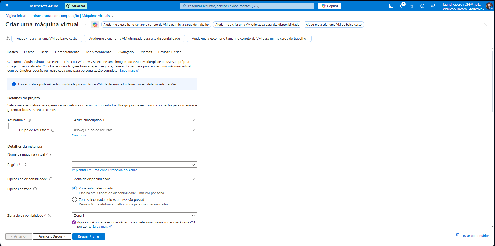

# 2️⃣Crie um Novo Recurso

* Na parte superior da dashboard terá a aba de serviços do Azure, veja se tem a opção Máquina Virtual (marcada com  a caixa vermelha na imagem)

<figure><figcaption></figcaption></figure>

* Caso não tenha a opção mencionada, clique nas 3 barras que estão localizadas no canto esquerdo da barra de navegação do Azure (indicadas pela seta na imagem acima)
* Irá abrir o menu exemplificado abaixo:

<figure><figcaption></figcaption></figure>

* Clique na opção Máquinas Virtuais (indicada pela caixa vermelha na imagem acima)
* A seguinte página será exibida:

<figure><figcaption></figcaption></figure>

* Clique no botão "Criar" (indicado pela caixa vermelha na imagem acima)
*   As seguintes opções serão exibidas:\

    <figure><figcaption></figcaption></figure>
* Clique em "Máquina Virtual"
*   A seguinte página será exibida:\

    <figure><figcaption></figcaption></figure>
